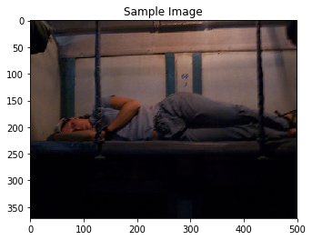

# Image Captioning (Computer Vision Nanodegree Project)
  
The Microsoft **C**ommon **O**bjects in **CO**ntext (MS COCO) dataset is a large-scale dataset for scene understanding.  The dataset is commonly used to train and benchmark object detection, segmentation, and captioning algorithms.  


You can read more about the dataset on the [website](http://cocodataset.org/#home) or in the [research paper](https://arxiv.org/pdf/1405.0312.pdf).

In this notebook, you will explore this dataset, in preparation for the project.

---

## Demo

To see the working of this project please to [3_Inference.ipynb](3_Inference.ipynb).

---

## Model Architecture

- **Encoder**


- **Decoder**


- **Model**


---

## Screenshots

```bash
  1. Some of best predictions.
```
 

> a man riding skis down a snow covered slope.


> a large jetliner flying through the air.

```bash
  2. Some of not the best predictions.
```
 

> a man is sitting on a couch with a laptop.


> a fire hydrant on a sidewalk next to a building.
